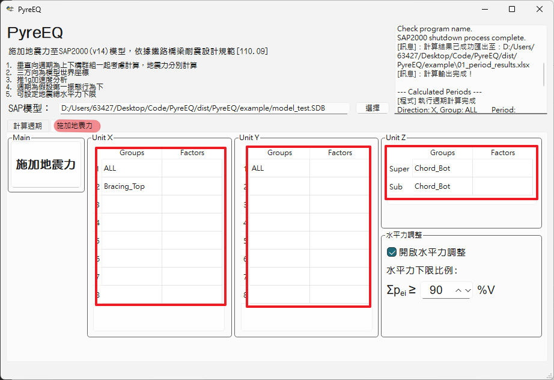

地震力計算
===
加速度係數
===
在`施加地震力`頁簽會出現兩欄。  
  
GROUPS為週期計算選擇自動帶入的群組，使用者可以自行更改其他GROUP
FACTORS為地震力加速度係數，請自行自算填入　　
> [!tip]
> Unit-X, Unit-Y請填入計算之$V/(W+L_E)$
> Unit-Z 之上部結構為$\alpha_vIS_{II,s}/\alpha_y$，下部結構為$\alpha_vI(0.4S_{II,s})/\alpha_y$  

> [!warning]
> FACTORS請與GROUPS一樣多數值，若不想考慮該方向，請於此填0，如此計算得力量為0。若違反前述，程式將當住。

水平力調整
===
由`鐵路橋梁耐震數計規範2.7節`總橫力分配方法為:  
$$
\begin{aligned}
p_e(x) &= \frac{\Sigma w(x)v_s(x)}{\Sigma w(x) v{^2}{_s}(x)}w(x)v_s(x)\frac{V}{W+L_E} \\
\end{aligned}
$$  
- 該公式實為振態疊加法，若依規範說明將得到第一振態貢獻地震力，此結果將小於總橫力V(可由柯西不等式證明)，故僅較適用於規則橋梁，否則將得到過小地震力。  
- 為避免過小地震力，使用者可調整計算出來之$p_e(x)$須至少為總橫力V之多少百分比，程式參考動力分析要求預設須達90%總橫力V。倘若第一振態參與質量過小，建議仍須依規範進行動力分析。  
- 調整方法為直接將$\Sigma p_e(x)$放大至需求V。
 

地震力施加
===
   
按`施加地震力`按鈕，`PyreEQ`將計算地震力並加入SAP模型中，LoadCase分別為EQL, EQT, EQV
>[!warning]
> - 程式預設強迫寫入load case名稱`EQL`, `EQT`, `EQV`
> - 程式施加力量前會清除模型中`EQL`, `EQT`, `EQV`所有已加節點力，若有額外力量施加需求，後續務必重新施加

分析結果
===
相關計算過程與結果會寫入與模型同路徑之`02_eqforce_results.xlsx`，使用者可以檢查驗算。