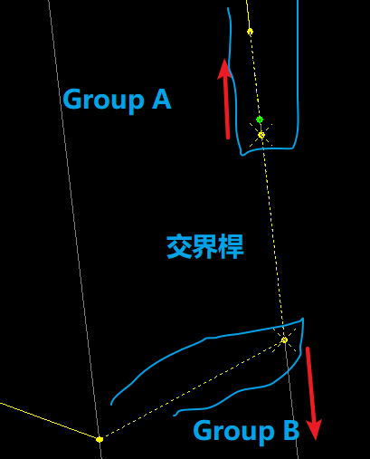

模型設定
===
GROUP設定
===
PyreEQ仿照Sunny的PreEQ，因此操作上近似PreEQ之作法。

Unit-X群組設定 
---  
X方向為取世界坐標系X方向，而通常建模X向為橋梁縱方向。
> [!Tip]
> SAP API為呼叫模型present coordinate system  

因此Roller柱單元為獨立振動單元，其餘為主要振動單元。依情境設定後續計算用GROUP。

Unit-Y群組設定 
---  
Y方向為取世界坐標系Y方向，而通常建模Y向為橋梁橫方向。  
非特別需求不用特別設定，採`ALL`即可。

Unit-Z群組設定 
---  
Z方向為取世界坐標系Z方向，而通常建模Z向為橋梁垂直方向。  
惟因上下構分別加不同加速度係數，故應分別設定上構及下構之GROUP。
> [!NOTE]
> 上下構群組用途為分開加不同地震力係數用途。另，現行規範避免工程師犯錯，垂直向加速度係數採$S_{II,s}$，與週期脫鉤，但程式仍以所選上下構群組合併計算週期。　　

GRUOP分群建議
---
在同一方向上分群，會有群組交界分類問題，因SAP運作為先認桿件，再選取桿件上NODE。也就是SAP會先找GROUP有哪些element，再由element尋找包含的node。  
因此在交界處的桿件可以2個group都不包含進去(但仍請檢察SAP都有抓到該抓的node)，若無做此小技巧，SAP會重複選到交界的node。`PyreEQ`處理方式為以`第一筆`進入程式計算的數據為準，忽略後續相同node之數據。  
 
> [!note]
> 但通常交界處都是剛性桿，都無質量，因此不影響計算。

質量來源
===
週期與地震力計算涉及之質量，程式採由SAP API呼叫MASS SOURCE，並取預設之`GLOBAL MASS SOURCE`為質量來源。鐵路規範考慮列車重，為(W+L)，使用者須在MASS SOURCE中設定列車載重作為質量來源，如此獲取之nodal mass才包含列車載重作為質量。

位移定義
===
抓取之位移系統為該node之local coordinate system，但`PyreEQ`或`PreEQ`並不會特定轉座標，直接默定為與世界座標同方向。因此曲橋等會設定轉座標，須注意該點是否有質量，若有須自行考慮修正，若無則不受影響。