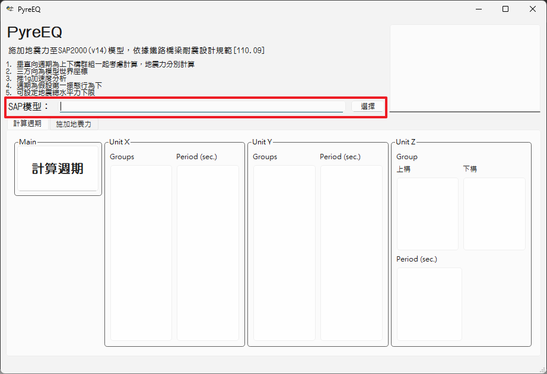

週期計算
===
模型選擇
===
開啟程式後會看到以下畫面，按選擇按鈕選擇欲分析的SAP之SDB模型。  
  
程式會開啟SAP模型進行`GROUP`清單讀取以供選擇。
> [!warning]
> 啟動程式前，強烈建議關閉SAP2000所有模型，避免`PyreEQ`無法正確繼承SAP物件導致錯誤

當GROUP清單顯示出後，請依須選擇要計算的GROUP，Unit-X及Unit-Y可複選。須注意的是不可選僅含剛棒（無質量）的群組，在週期計算上會除以零，導致致算錯誤，程式直接卡住。

>[!NOTE]
>即使沒有計算需求每方向仍應選擇GROUP，目前程式預設為三方向皆須計算    　　

  

選擇完成後，按計算週期按鈕執行  
  

週期計算
===
週期計算方式採`鐵路橋梁耐震設計規範C2.3.3`節之方法計算。
- `PyreEQ`透過API設定三方向推1g $(g=9.81 m/s^2)$的加速度LOAD CASE
- 獲取Nodal Mass及Displacement
- 計算週期  
$$
\begin{aligned}
T &= 2\pi\sqrt{\frac{\zeta}{\beta g}} \\
where, \\
\quad\zeta &= \Sigma w_i u{^2}{_i} \\
\quad\beta &= \Sigma w_i u_i
\end{aligned}
$$
- 程式會將計算結果顯示於畫面Perios欄位及狀態框內
  

分析結果
===
相關計算過程與結果會寫入與模型同路徑之`01_period_results.xlsx`，使用者可以檢查驗算。